# CameraAI

A real-time computer vision system that tracks table occupancy in restaurants using CCTV footage, developed during a hackathon by a software engineer intern on the capital team.

## Overview

This project leverages computer vision to generate actionable insights from existing CCTV infrastructure in restaurant environments. The system detects people in video feeds, maps them to predefined table zones, and displays real-time occupancy data on a 2D dashboard.

**Key Features:**
- Real-time people detection and tracking
- Spatial mapping of detected individuals to table zones
- Live 2D dashboard visualization
- Frame-by-frame analytics with timestamps
- No LLM dependencies—runs entirely on local computer vision models

## Demo

### Live Dashboard View

### Computer Vision Detection

## System Architecture

```mermaid
flowchart TD
    subgraph ZoneConfig["Zone Configuration"]
        A[(CCTV Video Feed)]
        B[⚙️ Initial Setup]
        C[📍 Define Table Areas]
        D[(Zone Configuration)]
        
        A --> B
        B --> C
        C --> D
    end
    
    subgraph CV["Computer Vision"]
        E[🤖 OpenCV Detection]
        F[👥 Object Recognition]
        
        E --> F
    end
    
    subgraph Spatial["Spatial Analysis"]
        G[📄 Zone Mapping]
        H[📁 Object Assignment]
        
        G --> H
    end
    
    subgraph Visualization["Real-time Visualization"]
        I[📊 Occupancy Tracking]
        J[📺 Live Dashboard]
        K[🖼️ Display Output]
        
        I --> J
        J --> K
    end
    
    B --> E
    D --> G
    F --> G
    H --> I
    I --> L[(Analytics Data)]
    K --> M[🖥️ Real-time Monitoring]
```

## How It Works

### 1. Zone Configuration (One-time Setup)

Before the system can begin real-time tracking, table zones must be defined through a manual configuration process. This involves drawing specific pixel regions from the CCTV feed and associating them with table identifiers (e.g., Table 1, Table 2). This spatial mapping creates a link between visual data and digital table objects, and the configuration persists indefinitely for that camera angle.

### 2. Computer Vision Processing

The live video feed is processed by an OpenCV model running locally. The model detects people within each frame without requiring any external API calls or LLM services. This approach ensures low latency and maintains data privacy since all processing occurs on-premises.

### 3. Spatial Analysis

Once people are detected, the system maps them to the predefined table zones. Assignment is based on proximity—individuals are assigned to a table if they fall within what is considered "sitting distance" of that zone. This creates a real-time count of occupants per table.

### 4. Real-time Visualization

The occupancy data feeds into a live dashboard that renders a 2D representation of the restaurant floor plan. Each table displays its current occupant count, updated in real-time with no pre-processing delay. The visualization provides immediate insight into restaurant capacity and seating patterns.

### 5. Analytics Storage

Beyond the live display, the system stores frame-by-frame analytics with timestamps. This historical data enables trend analysis and operational insights over time.

## Technical Details

- **Video Input:** Live CCTV feed from restaurant
- **Processing:** Local OpenCV model
- **Dependencies:** No LLM or cloud AI services required
- **Output:** Real-time 2D dashboard + stored analytics data

## Future Vision

The system is designed as an extensible engine for collecting visual data and building comprehensive data models. Planned enhancements include:

- **Server Response Time:** Measure elapsed time between customer seating and first server interaction
- **Server Touch Tracking:** Count the number of server visits per table throughout the dining experience
- **Automated Zone Configuration:** Replace manual table zone definition with computer vision-based automatic detection

These extensions would provide powerful operational insights for restaurant management, enabling data-driven decisions about staffing, service quality, and customer experience optimization.

## Use Cases

- Monitor real-time table availability
- Analyze peak occupancy patterns
- Optimize server section assignments
- Identify service bottlenecks
- Track table turnover rates

---

*Developed during a hackathon by a software engineer intern on the capital team*

